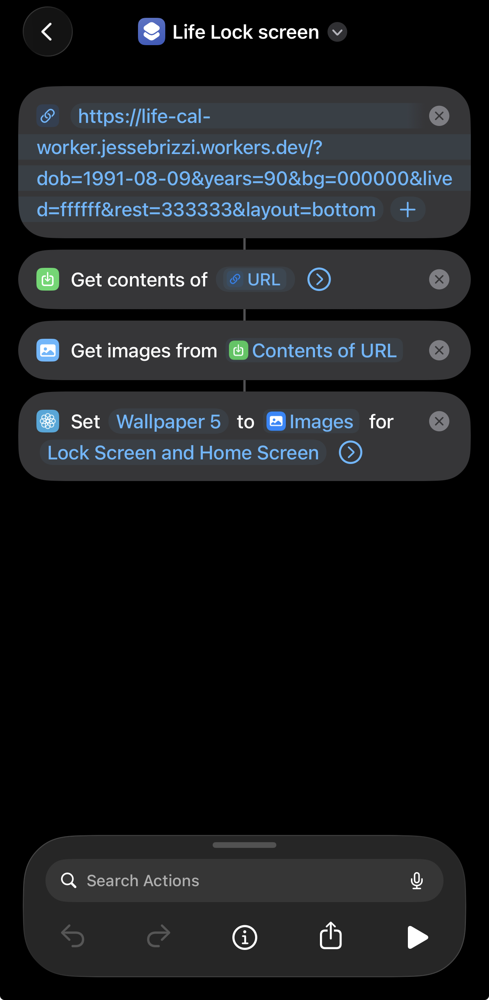
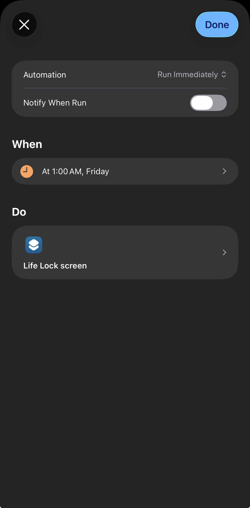

# Life Calendar Wallpaper

[https://jes-bz.github.io/life-cal/](https://jes-bz.github.io/life-cal/)

A "Memento Mori" life calendar generator that visualizes your life in weeks. It generates a wallpaper for your phone showing weeks lived versus weeks remaining, helping you stay mindful of your time.

The project consists of:
1.  **Static Website**: An interactive configuration tool to set your birthdate, life expectancy, and colors.
2.  **Cloudflare Worker**: A serverless function that generates the PNG wallpaper on-the-fly, enabling automation.

## Features

*   **Interactive Preview**: Visualize your calendar instantly in the browser.
*   **Customizable**: Adjust colors, layout, and life expectancy.
*   **High Resolution**: optimized for modern smartphone displays (iPhone 16 Pro Max resolution default).
*   **Automation Ready**: Use the Cloudflare Worker to automatically update your wallpaper every week.

## iPhone Automation Guide

You can set up your iPhone to automatically update its lock screen with your Life Calendar every week, keeping the "weeks lived" accurate without manual intervention.

### Prerequisites
*   The **Config Link** for your specific calendar setup.
    *   Go to your deployed website (or run it locally).
    *   Configure your dates and colors.
    *   Click **"Copy Config Link"**.
    *   *Note: You will need the parameters from this URL (everything after the `?`).*

### Step 1: Create the Shortcut

1.  Open the **Shortcuts** app on your iPhone.
2.  Tap the **+** to create a new shortcut.
3.  Add the following 4 actions in order:

    1.  **URL**: Paste your full Worker URL here (e.g., `https://your-worker.workers.dev/?dob=...`).
    2.  **Get Contents of URL**: Set this to get contents of the **Text** from the previous step.
    3.  **Get Images from Input**: Set this to get images from the **Contents of URL**.
    4.  **Set Wallpaper**: 
        *   Set image to **Images**.
        *   Choose "Lock Screen" (and/or Home Screen).
        *   **Important**: Tap the arrow on the "Set Wallpaper" action and turn **OFF** "Show Preview".

### Step 2: Schedule the Automation

1.  Go to the **Automation** tab in the Shortcuts app.
2.  Tap **New Automation** (or the + sign).
3.  Choose **Time of Day**.
4.  Set it to **Weekly** (e.g., every Monday at 9:00 AM).
5.  Select **Run Immediately** (so it doesn't ask for confirmation).
6.  On the next screen, select the Shortcut you created in Step 1.

